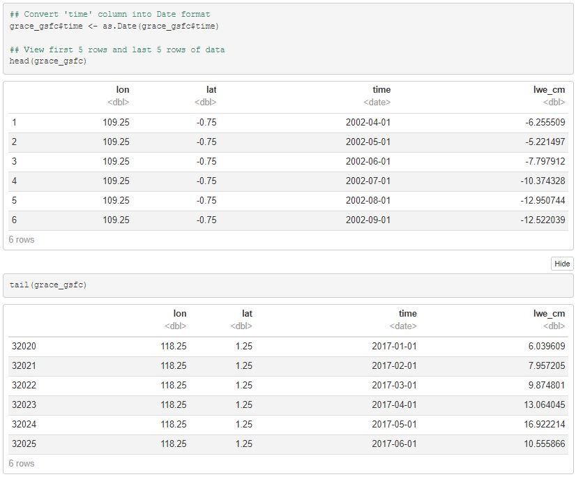
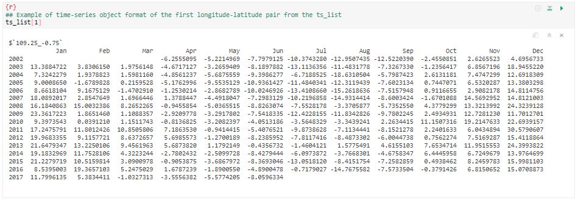
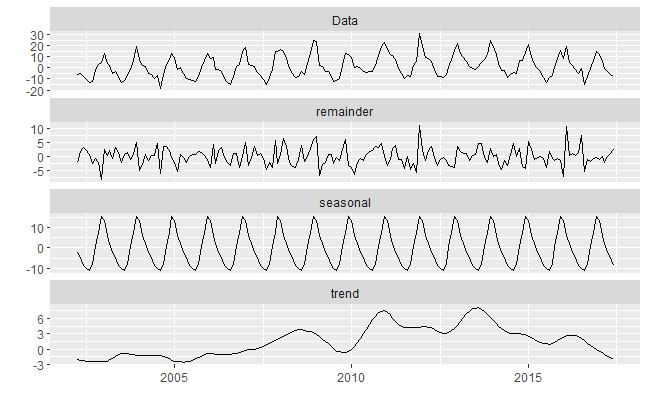
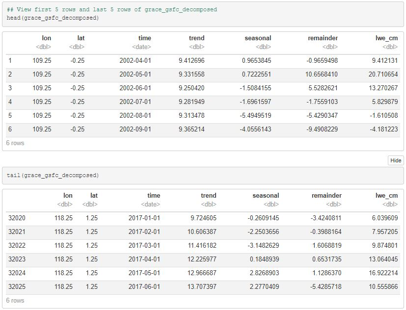

# Seasonal and Trend decomposition using Loess (STL) for Spatio-temporal Data

## Overview
This project conducts signal decomposition on spatiotemporal data, such as hydrological data that varies spatially across grids over a specific period. The decomposition process is applied to terrestrial water storage anomaly (TWSA) data from the GRACE satellite mission. 

The method used to decompose the hydrological data is **Seasonal and Trend decomposition using Loess (STL)**. The original/raw signal will be decomposed into three constituents: trend (including linear and non-linear trends), seasonal, and remainder or residual. For additional literature, please read [Cleveland et al. (1990)](https://www.wessa.net/download/stl.pdf).

```math
X_{tot} = X_{trend} + X_{seasonal} + X_{remainder}
```

## About Data
The main data is provided in a CSV format (**file = GRACE-GSFC_2002.04_2017.06.csv**). The raw data was downloaded from [NASA Goddard Space Flight Center (GSFC)](https://earth.gsfc.nasa.gov/geo/data/grace-mascons) with spatial and temporal resolutions of 0.5 degrees and 1 month, respectively, and in *nc format. The source code to convert *nc data to a data frame refers to [DSSG2023-Groundwater by uwescience](https://github.com/uwescience/DSSG2023-Groundwater/tree/main). The short-term gap in the GRACE GSFC data was already filled using the simple linear interpolation approach.

The data covers the Kalimantan Island of Indonesia and contains four columns: 
1. **lon** = longitude;
2. **lat** = latitude;
3. **time** = monthly time from 2002.04 to 2017.06; and
4. **lwe_cm** = liquid water equivalent in centimeters, also known as the terrestrial water storage anomaly.

## R-Script
The main R-script is in **STL-Decomposition-GRACE.R**. Four primary stages included in the code comprise:
1. Library (installation and) preparation;
2. Calling the CSV data;
3. Creating a time series object for each grid;
4. Performing STL for each grid; and
5. Converting the decomposed signal into a DataFrame.

## Output
Result for: <br />
`head(grace_gsfc)` and <br />
`tail(grace_gsfc)` <br />


Result for: <br />
`ts_list[1]`<br />


Result for: <br />
`autoplot(object = stl_list[1],ncol = 1)`<br />


Result for: <br />
`head(grace_gsfc_decomposed)` and <br />
`tail(grace_gsfc_decomposed)` <br />


### Reference
Hartmann, K., Krois, J., Rudolph, A. (2023): Statistics and Geodata Analysis using R (SOGA-R). Department of Earth Sciences, Freie Universitaet Berlin [Available at: https://www.geo.fu-berlin.de/en/v/soga-r/Advances-statistics/Time-series-analysis/Seasonal-decompositon/Seasonal-and-Trend-decomposition-using-Loess/index.html].
### Contact
For suggestions and collaboration, kindly reach me at: [LinkedIn](https://www.linkedin.com/in/rizka-amelia-dwi-safira/) or rizkasafira20@gmail.com.
